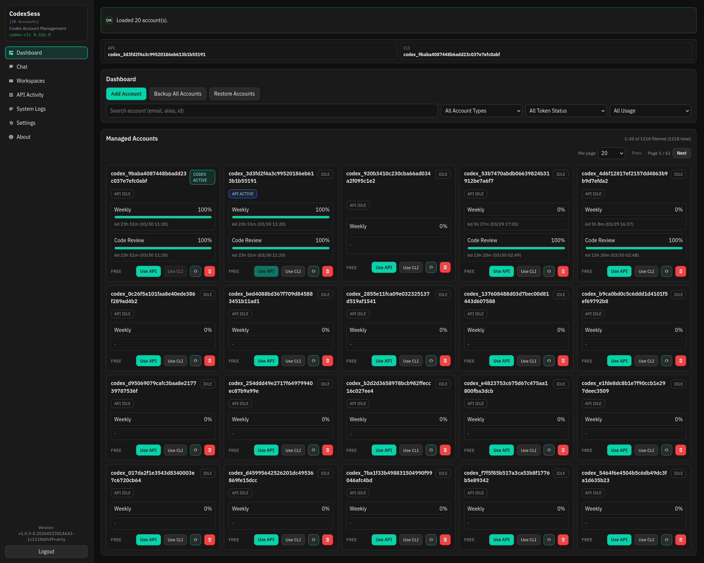
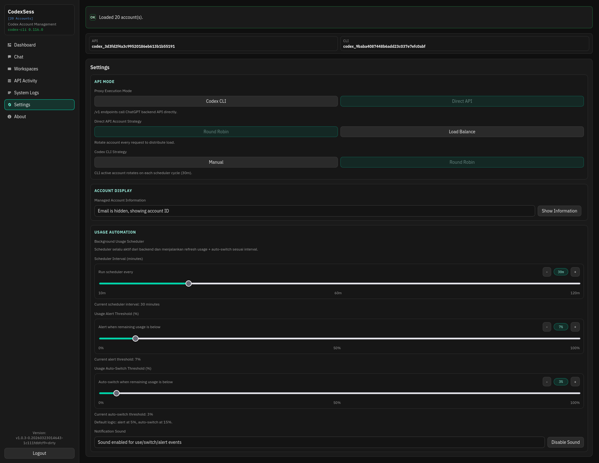
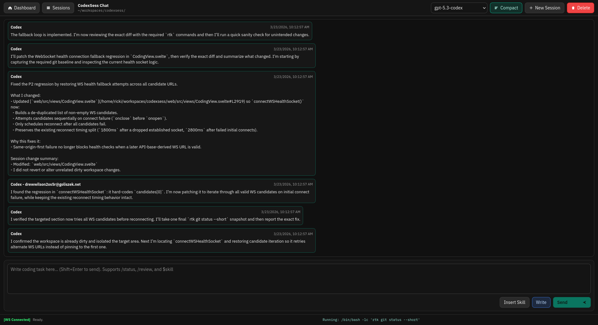
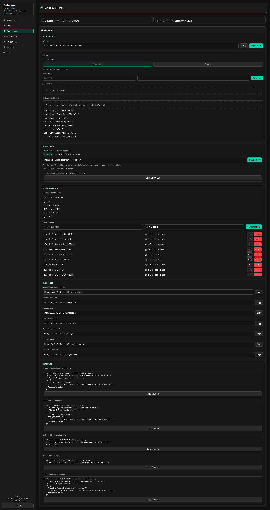
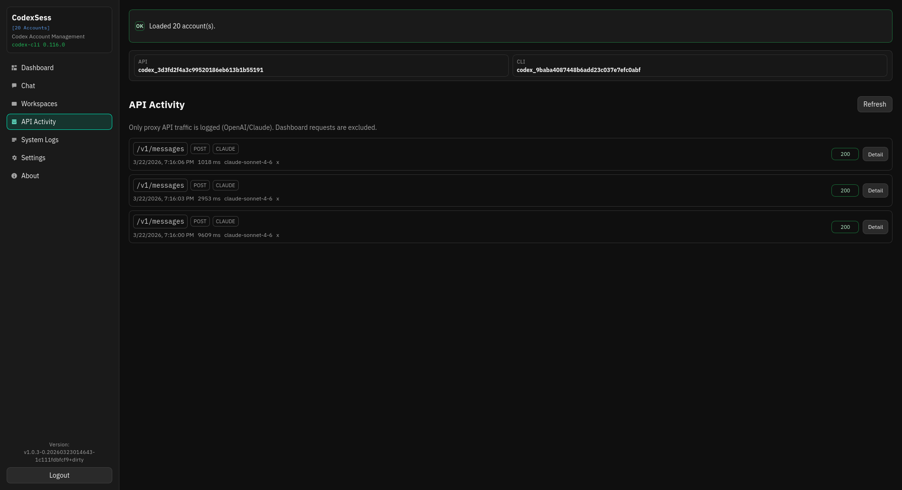
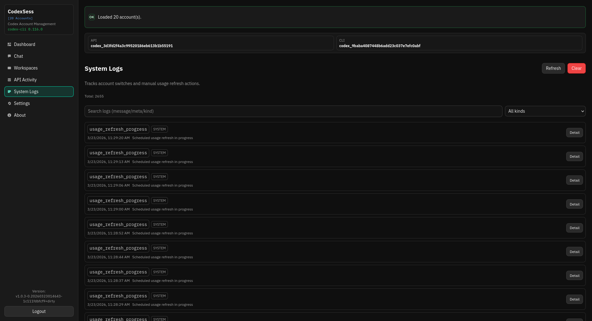

# CodexSess Console

<div align="center">
  

  <h3>Control Plane Web-First untuk Akun Codex dan Workspace `/chat`</h3>
  <p>Kelola routing multi-akun API/CLI, otomasi berbasis usage, dan workspace coding browser yang persisten dalam satu binary.</p>

  <p>
    <a href="https://github.com/rickicode/CodexSess/releases/latest">
      
    </a>
    
    
    
    
  </p>

  <p>
    <a href="./README.md">English</a> |
    <a href="./README.id.md"><strong>Bahasa Indonesia</strong></a>
  </p>

  <p>
    <a href="#ringkasan">Ringkasan</a> •
    <a href="#pembaruan-besar-terbaru">Pembaruan Besar Terbaru</a> •
    <a href="#fitur-utama">Fitur Utama</a> •
    <a href="#workspace-chat-chat">Workspace Chat</a> •
    <a href="#workflow-github-code-review">GitHub Code Review</a> •
    <a href="#pratinjau-ui">Pratinjau UI</a> •
    <a href="#autentikasi--sesi">Autentikasi</a> •
    <a href="#variabel-lingkungan">Environment</a> •
    <a href="#instalasi-linux">Instalasi</a>
  </p>
</div>

## Ringkasan

CodexSess adalah gateway akun berbasis web untuk penggunaan Codex/OpenAI.

Dirancang untuk operator yang membutuhkan:

- perpindahan akun yang cepat
- pemisahan akun aktif untuk API dan Codex CLI
- otomasi berbasis usage (alert + auto switch)
- surface API kompatibel OpenAI untuk penggunaan produksi

Untuk penggunaan normal, unduh binary/package dari halaman rilis terbaru:

- https://github.com/rickicode/CodexSess/releases/latest

## Pembaruan Besar Terbaru

- `/chat` sekarang menjadi workspace coding chat-first yang normal:
  - sesi, riwayat chat, dan context workspace tetap persisten
  - pemilih workspace + saran path untuk memulai atau melanjutkan kerja dengan cepat
  - satu timeline percakapan kronologis tanpa mode switch planner/executor tersembunyi
  - bubble event bergaya Codex untuk balasan assistant, output terminal, aktivitas MCP/tool, subagent, dan operasi file
  - activity stream realtime berbasis WebSocket (`/api/coding/ws`) dengan auto reconnect dan indikator status koneksi (`[WS Connected/Connecting/Disconnected]`)
  - kontrol stop dua tahap (`Stop` lalu `Force Stop`), slash command (`/status`, `/review`), dan skill picker
- Integrasi Zo kompatibel OpenAI:
  - manajemen multi Zo API key di dashboard
  - tracking request per key (`Requests` + `Last request`)
  - cache daftar model Zo dan dukungan model mapping
- Peningkatan direct API dan otomasi routing:
  - direct API mode untuk client kompatibel OpenAI + Claude
  - strategi Codex CLI: `round_robin` (rotasi terjadwal) dan `manual` (switch berbasis threshold)
  - default auto-switch threshold: `15%`
  - scheduler backend untuk cek usage periodik dan fallback akun aktif
- Observability sistem baru:
  - halaman System Logs dengan rotasi data berbasis database
  - log source refresh usage dan log perpindahan API/CLI lebih jelas

## Kenapa CodexSess Dibuat

CodexSess dibuat untuk menyederhanakan operasi multi-akun Codex tanpa memecah tool.

Daripada mengelola script terpisah, edit token manual, dan dashboard yang berbeda, CodexSess memusatkan:

- kontrol akun API aktif
- kontrol akun CLI aktif
- visibilitas usage akun
- keputusan fallback otomatis saat limit menipis

## Fitur Utama

- Endpoint proxy kompatibel OpenAI dan Claude:
  - `POST /v1/chat/completions` (termasuk SSE streaming)
  - `GET /v1/models`
  - `POST /v1/responses`
  - `POST /claude/v1/messages`
- Pemisahan status akun aktif:
  - akun API aktif
  - akun CLI (Codex) aktif
- Strategi routing multi-akun:
  - CLI `round_robin` (interval scheduler default: 5 menit)
  - CLI `manual` (auto-switch saat sisa usage di bawah threshold)
- Refresh usage dan otomasi:
  - threshold alert
  - perilaku auto-switch yang bisa dikonfigurasi
  - default auto-switch threshold 15% (bisa diubah di Settings/API)
- Operasi Zo API key:
  - tambah/hapus banyak Zo API key
  - pantau jumlah request per key
  - gunakan daftar model Zo untuk mapping
- Workspace coding berbasis browser:
  - sesi `/chat` dengan context persisten, satu timeline chat-first, dan bubble event bergaya Codex

## Workspace Chat (`/chat`)

`/chat` adalah workspace coding browser utama di CodexSess.

Anda membuka satu sesi, memilih workspace, lalu melanjutkan pekerjaan di percakapan yang sama tanpa berpindah ke mode planner atau executor tersembunyi.
Riwayat, state runtime, dan context workspace tetap menempel pada sesi, jadi tampilannya terasa seperti meja kerja Codex yang persisten, bukan kotak prompt sementara.

Alur `/chat` dirancang untuk penggunaan harian:

- lanjutkan sesi yang sudah ada dari daftar sesi tanpa menyusun ulang context
- mulai sesi baru lewat pemilih workspace dan saran path
- ikuti satu timeline kronologis yang mencampur balasan assistant dan aktivitas runtime sesuai urutan kejadian
- baca bubble event bergaya Codex untuk output terminal, aktivitas MCP/tool, subagent, dan operasi file (`Edited`, `Read`, `Created`, `Deleted`, `Moved`, `Renamed`) tanpa membongkar log mentah
- pantau update realtime lewat WebSocket (`/api/coding/ws`) dengan reconnect otomatis dan status koneksi yang terlihat
- hentikan run dengan aman lewat kontrol dua tahap `Stop` -> `Force Stop`
- gunakan helper chat seperti `/status`, `/review`, dan penyisipan `$skill_name` langsung dari composer

Ini membuat `/chat` cocok sebagai workspace coding yang bisa dipakai dari desktop, remote, maupun mobile dengan satu mental model yang jelas: ngobrol dengan Codex di satu sesi persisten dan lihat semua aktivitasnya muncul langsung di timeline itu.
- Observability sistem:
  - tampilan System Logs dengan rotasi log otomatis
- Web console + API proxy tertanam dalam satu binary

## Pratinjau UI

<table>
  <tr>
    <td align="center">
      
    </td>
    <td align="center">
      
    </td>
  </tr>
  <tr>
    <td align="center">
      
    </td>
    <td align="center">
      
    </td>
  </tr>
  <tr>
    <td align="center">
      
    </td>
    <td align="center">
      
    </td>
  </tr>
</table>

## Autentikasi & Sesi

- Console manajemen membutuhkan login.
- Kredensial default saat first-run:
  - username: `admin`
  - password: `hijilabs`
- Durasi remember session: 30 hari.
- Ganti password via CLI:
  - `--changepassword`

Route kompatibilitas API di `/v1/*` dan `/claude/v1/*` tetap route bergaya API key dan tidak diblok alur login web UI.
Artinya client OpenAI maupun client bergaya Claude sama-sama bisa diarahkan lewat CodexSess.

## Workflow GitHub Code Review

Untuk menggunakan review/autofix PR:

- Gunakan file workflow: `.github/workflows/code-review.yml`
- Tambahkan GitHub repository secret wajib:
  - `CODEXSESS_URL`
  - `CODEXSESS_API_KEY`
- Secret opsional:
  - `EXA_API_KEY` (untuk mengaktifkan Exa MCP di workflow)
- Trigger:
  - otomatis saat event `pull_request`
  - manual lewat `workflow_dispatch`
- Input manual (`workflow_dispatch`):
  - `target_ref` (opsional, branch/tag/sha; default `main`)
  - `review_scope` (`diff` atau `full`)
  - `review_focus` (opsional, area fokus review)

Catatan:

- `review_scope=full` membuat review mencakup keseluruhan repository (tidak tergantung diff commit saja).
- `review_focus` dipakai untuk mengarahkan review manual ke area tertentu (contoh: `auth`, `api`, `performance`, `tests`).
- Run manual akan membuat branch baru otomatis jika ada autofix yang aman untuk di-push.
- Workflow akan mengatur MCP default untuk Codex di CI:
  - `filesystem` (gratis)
  - `sequential_thinking` (gratis)
  - `memory` (gratis)
  - `exa` (aktif jika `EXA_API_KEY` tersedia)

## Variabel Lingkungan

| Variabel                          | Default           | Contoh                                                          | Deskripsi                                                                                                                                                                    |
| --------------------------------- | ----------------- | --------------------------------------------------------------- | ---------------------------------------------------------------------------------------------------------------------------------------------------------------------------- |
| `PORT`                            | `3061`            | `PORT=8080`                                                     | Port HTTP server.                                                                                                                                                            |
| `CODEXSESS_PUBLIC`                | `false`           | `CODEXSESS_PUBLIC=true`                                         | Aktifkan bind public (`0.0.0.0:<PORT>`). Jika false, bind hanya lokal (`127.0.0.1:<PORT>`).                                                                                  |
| `CODEXSESS_NO_OPEN_BROWSER`       | `false`           | `CODEXSESS_NO_OPEN_BROWSER=true`                                | Menonaktifkan auto-open browser saat startup. Nilai truthy: `1`, `true`, `yes`.                                                                                              |
| `CODEXSESS_CODEX_SANDBOX`         | `workspace-write` | `CODEXSESS_CODEX_SANDBOX=read-only`                             | Mode sandbox yang diteruskan ke `codex exec`.                                                                                                                                |
| `CODEXSESS_CLEAN_EXEC`            | `true`            | `CODEXSESS_CLEAN_EXEC=false`                                    | Jalankan eksekusi Codex dalam mode isolasi (`true`) atau environment normal (`false`).                                                                                       |
| `CODEXSESS_CLI_SWITCH_NOTIFY_CMD` | ``                | `CODEXSESS_CLI_SWITCH_NOTIFY_CMD="peon preview resource.limit"` | Command opsional saat akun CLI aktif berpindah. Env: `CODEXSESS_CLI_SWITCH_FROM`, `CODEXSESS_CLI_SWITCH_TO`, `CODEXSESS_CLI_SWITCH_REASON`, `CODEXSESS_CLI_SWITCH_TO_EMAIL`. |

Catatan:

- Di Windows, direktori data default adalah `%APPDATA%\\codexsess` jika `APPDATA` tersedia.
- `CODEX_HOME` diatur internal per akun aktif dan bukan switch runtime eksternal untuk CodexSess.

## Instalasi (Linux)

Gunakan installer dari raw script repository:

```bash
curl -fsSL https://raw.githubusercontent.com/rickicode/CodexSess/main/scripts/install.sh | bash
```

Contoh mode:

```bash
# auto (default)
curl -fsSL https://raw.githubusercontent.com/rickicode/CodexSess/main/scripts/install.sh | bash -s -- --mode auto

# install package GUI (.deb/.rpm)
curl -fsSL https://raw.githubusercontent.com/rickicode/CodexSess/main/scripts/install.sh | bash -s -- --mode gui

# install server / cli
curl -fsSL https://raw.githubusercontent.com/rickicode/CodexSess/main/scripts/install.sh | bash -s -- --mode server

# update tipe instalasi yang sudah ada (auto-detect gui/server)
curl -fsSL https://raw.githubusercontent.com/rickicode/CodexSess/main/scripts/install.sh | bash -s -- --mode update
```

Instalasi Windows:

- Unduh file `.exe` langsung dari:
  - https://github.com/rickicode/CodexSess/releases/latest

## Cakupan Proyek

Fokus CodexSess adalah keandalan operasional untuk penggunaan akun Codex:

- pemilihan akun yang konsisten
- visibilitas status aktif yang jelas
- otomasi usage-aware dan fallback
- surface integrasi kompatibel OpenAI
